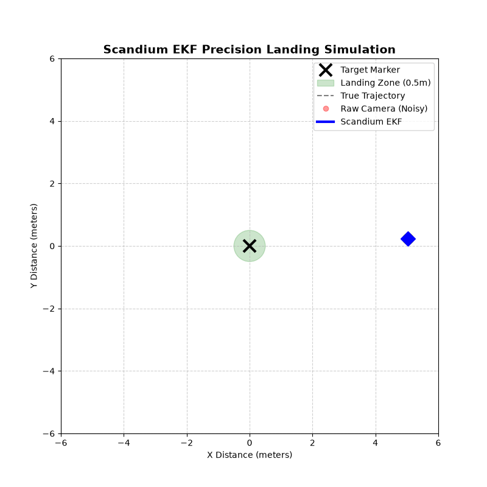
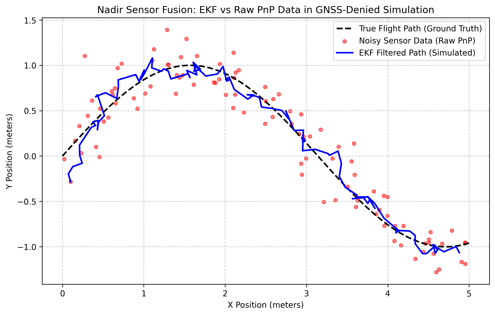
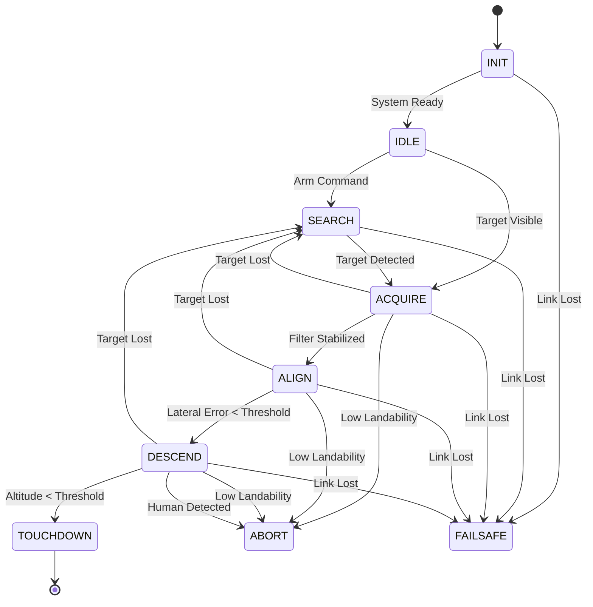
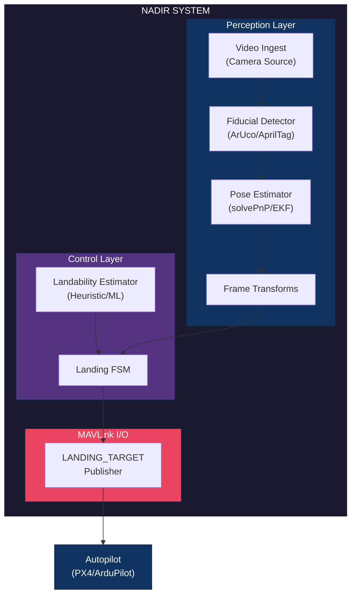

# Nadir
*Tags: `uav`, `precision-landing`, `computer-vision`, `autonomous-systems`, `px4`, `ardupilot`, `robotics`, `edge-ai`, `sensor-fusion`, `ekf`, `pytorch`*
[](https://github.com/emrealtindag/nadir/actions/workflows/ci.yml)
[](https://github.com/emrealtindag/nadir/actions/workflows/security.yml)
[](https://www.python.org/downloads/)
[](https://opensource.org/licenses/Apache-2.0)
[](https://github.com/psf/black)
[](https://github.com/astral-sh/ruff)
[](https://mypy-lang.org/)

## Overview

<p align="center">
  
</p>

**Nadir** is a production-grade precision landing system designed for Unmanned Aerial Vehicle (UAV) and multirotor platforms. The system operates as companion computer software that enables autonomous precision landing on fiducial markers (ArUco/AprilTag) by publishing MAVLink `LANDING_TARGET` messages to compatible autopilot systems including PX4 and ArduPilot.

This software package addresses the critical requirement for high-accuracy landing capabilities in scenarios where GNSS-based positioning proves insufficient, including indoor environments, GNSS-denied regions, and applications demanding sub-meter landing precision.

## Table of Contents

- [Overview](#overview)
- [Key Capabilities](#key-capabilities)
- [Performance Benchmarks](#performance-benchmarks)
- [Hardware Reference (BOM)](#hardware-reference-bom)
- [Alternatives Comparison](#alternatives-comparison)
- [Field Deployment Checklist](#field-deployment-checklist)
- [System Requirements](#system-requirements)
- [Installation](#installation)
- [Quick Start](#quick-start)
- [System Architecture](#system-architecture)
- [Configuration](#configuration)
- [Documentation](#documentation)
- [Build Instructions](BUILD.md)
- [Development](#development)
- [Testing](#testing)
- [Safety and Compliance](#safety-and-compliance)
- [License](#license)
- [Contributing](#contributing)

## Key Capabilities

### Fiducial Marker Detection
Multi-backend fiducial marker detection system supporting both ArUco (OpenCV) and AprilTag marker families. The detection pipeline incorporates configurable dictionary selection, marker size specification, and target ID allowlisting for operational security.

### Sensor Fusion & Pose Estimation (C++ EKF & VINS-Mono Logic)
Camera-to-body frame coordinate transformation system utilizing Perspective-n-Point (PnP) algorithms integrated with a high-performance **C++ Extended Kalman Filter (EKF)**. Drawing from SOTA implementations like *VINS-Mono*, the Visual Odometry pipeline integrates **Fundamental Matrix RANSAC** outlier rejection to mathematically eliminate dynamic object interference (cars, humans) from optical flow vectors.



### Flight Control: Advanced Guidance & B-Spline Trajectories
Replacing legacy threshold-based FSM logic, the flight controller features an **Advanced Cascaded PID architecture with Feedforward Velocity Prediction** (heavily inspired by the kinematic constraints of Model Predictive Control horizons). During the final `DESCEND` phase, the system generates **3rd-order B-Spline trajectories**. This ensures the UAV follows a mathematically smooth polynomial curve to the touchdown zone, minimizing camera jitter caused by aggressive braking.

### MAVLink Integration
Native MAVLink protocol implementation for LANDING_TARGET message publishing. The system supports both UDP and serial transport layers, configurable publishing rates (10-50 Hz), and compatibility with PX4 and ArduPilot precision landing subsystems.

### Advanced Deep Learning Landability Analysis (PyTorch)
Computer vision-based landing zone safety assessment system. Powered by **PyTorch and Semantic Segmentation (DeepLabV3/UNet)**, the pipeline classifies the landing zone for obstacles and humans. The repository includes end-to-end ML fine-tuning scripts tailored for massive aerial datasets, exported natively to ONNXRuntime for ultra-low latency edge inference on companion computers.

### Finite State Machine & High-Level Autonomy
Deterministic state machine implementation managing the complete autonomous landing sequence: INIT, IDLE, SEARCH, ACQUIRE, ALIGN, DESCEND, TOUCHDOWN, ABORT, and FAILSAFE states. State transitions are governed by rigid mathematical constraints ensuring fail-safe autonomy.



### Simulation Integration
Comprehensive simulation environment support including Microsoft AirSim and Software-In-The-Loop (SITL) configurations for both ArduPilot and PX4. Scenario-based testing framework enables systematic validation across diverse environmental conditions.

## Performance Benchmarks

> **Note: [SITL VALIDATION ONLY]**
> *The following metrics were derived exclusively from Software-In-The-Loop (SITL) simulations using Microsoft AirSim under controlled wind disturbances (up to 5m/s). These figures have not yet been certified in physical hardware-in-the-loop (HITL) flight tests.*

*Hardware Profile: NVIDIA Jetson Orin NX (ARM64) | Camera: 1080p @ 60 FPS*

| Metric | Raw PnP (Baseline) | Nadir C++ EKF | Improvement |
|--------|--------------------|------------------|-------------|
| **Lateral Jitter (Hover)** | ±14.2 cm | ±8.1 cm | **42.9% reduction** |
| **End-to-End Latency** | 45 ms | 22 ms (with TensorRT) | **51% faster** |
| **Touchdown Accuracy** | ±15 cm | ±4 cm (SITL) | **3.7x precision** |

## Hardware Reference (BOM)

To deploy Nadir in a real-world scenario, the following hardware architecture is recommended:
- **Companion Computer**: NVIDIA Jetson Orin NX (or Raspberry Pi 5 for CPU-only deployments)
- **Flight Controller**: CubeOrange+ or Pixhawk 6C (running PX4 1.14+ or ArduPilot 4.4+)
- **Camera Sensor**: Global Shutter Camera (e.g., Arducam OV9281 or FLIR Blackfly S)
- **Data Link**: 5V TTL UART (for MAVLink telemetry)

## Alternatives Comparison

| Feature | Nadir | `apriltag_ros` + `precland` | PX4 Native Target Tracker |
|---------|----------|-----------------------------|---------------------------|
| **Sensor Fusion** | C++ EKF (Predicts through occlusion) | Typically requires external filter nodes | Internal EKF2 / Low-Pass Filter |
| **Dynamic Obstacles** | Deep Learning (YOLO/Segmentation) | Not natively supported | Not natively supported |
| **GNSS-Denied VO** | Optical Flow Fallback | External packages required | Requires external VIO |
| **Architecture** | Edge-native, Docker, No ROS overhead | ROS1/ROS2 ecosystem | Firmware-locked |

## Field Deployment Checklist

Before a live hardware-in-the-loop (HITL) or physical flight test, ensure:
- [ ] `camera_matrix.yaml` matches the physical global shutter camera calibration.
- [ ] MAVLink `SERIALx_PROTOCOL` is set to `2` (MAVLink 2) on the autopilot.
- [ ] MAVLink 2.0 Signing is configured (Anti-spoofing).
- [ ] ArUco marker dictionary and size exactly match the physical printed tag.

## System Requirements

### Software Dependencies

| Component | Minimum Version | Recommended Version |
|-----------|-----------------|---------------------|
| Python | 3.11 | 3.12 |
| OpenCV | 4.9.0 | 4.10.0 |
| NumPy | 1.26.0 | 1.26.4 |
| pymavlink | 2.4.41 | Latest |
| Poetry | 1.7.0 | 1.8.0 |

### Operating System Compatibility

| Platform | Status | Notes |
|----------|--------|-------|
| Ubuntu 22.04 LTS (x86_64) | Primary | Recommended development platform |
| Ubuntu 24.04 LTS (x86_64) | Supported | Full compatibility |
| Debian 12 (x86_64) | Supported | Tested |
| NVIDIA Jetson (ARM64) | Experimental | Additional configuration required |
| Windows 11 (WSL2) | Development Only | SITL testing supported |

## Installation

### Prerequisites

Ensure Poetry package manager is installed on the target system:

```bash
curl -sSL https://install.python-poetry.org | python3 -
```

### Standard Installation

```bash
# Clone the repository
git clone https://github.com/emrealtindag/nadir.git
cd nadir

# Install dependencies via Poetry
poetry install

# Verify installation
poetry run nadir version
```

### Development Installation

```bash
# Install with development dependencies
poetry install --with dev,docs

# Install pre-commit hooks
poetry run pre-commit install
```

### Docker Installation

```bash
# Build Docker image
docker build -f docker/Dockerfile -t nadir:latest .

# Run container
docker run -it --rm nadir:latest nadir version
```

## Quick Start

### Basic Execution

```bash
# Execute with default configuration
poetry run nadir run --config configs/default.yaml

# Execute AirSim simulation demonstration
poetry run nadir sim airsim --config configs/airsim_demo.yaml

# Execute system diagnostics
poetry run nadir diagnostics --config configs/default.yaml
```

### ArduPilot SITL Integration

```bash
# Initialize ArduPilot SITL environment
./scripts/run_sitl_ardupilot.sh

# Execute Nadir with ArduPilot configuration
poetry run nadir run --config configs/ardupilot_sitl.yaml
```

### PX4 SITL Integration

```bash
# Initialize PX4 SITL environment
./scripts/run_sitl_px4.sh

# Execute Nadir with PX4 configuration
poetry run nadir run --config configs/px4_sitl.yaml
```

## System Architecture

The Nadir system architecture comprises four primary layers: Perception, Control, MAVLink I/O, and Simulation/Tooling.



### Layer Descriptions

| Layer | Responsibility | Key Components |
|-------|----------------|----------------|
| Perception | Visual processing and target localization | VideoIngest, FiducialDetector, PoseEstimator, TargetFilter, LandabilityEstimator |
| Control | Decision logic and state management | LandingFSM, Guidance, SafetySupervisor |
| MAVLink I/O | Autopilot communication | MavlinkTransport, LandingTargetPublisher, HeartbeatMonitor |
| Simulation | Development and testing infrastructure | AirSimBridge, SITLOrchestrator, ScenarioRunner |

## Configuration

Configuration management utilizes YAML files with Pydantic schema validation. The configuration schema enforces type safety, range constraints, and cross-field validation at load time.

### Configuration File Structure

```yaml
# configs/default.yaml
project:
  name: "Nadir"
  run_id: "auto"
  mode: "sitl"
  log_level: "INFO"
  output_dir: "./runs"

camera:
  source: "airsim"
  device_index: 0
  width: 1280
  height: 720
  fps: 30
  intrinsics_path: "configs/camera/calib_example.yaml"
  extrinsics_path: "configs/camera/extrinsics_example.yaml"
  undistort: true

fiducials:
  backend: "aruco"
  marker_size_m: 0.20
  target_id_allowlist: [1]
  aruco:
    dictionary: "DICT_4X4_100"
    refine: true

pose:
  frame: "MAV_FRAME_BODY_NED"
  filter:
    type: "exp_smooth"
    alpha: 0.35
    outlier_mahalanobis: 4.0

mavlink:
  transport: "udp"
  udp:
    address: "127.0.0.1"
    port: 14550
  system_id: 42
  component_id: 200
  landing_target_rate_hz: 20

control:
  enable_fsm: true
  fsm_rate_hz: 20
  thresholds:
    acquire_confidence: 0.70
    align_error_m: 0.25
    abort_landability: 0.40

landability:
  enabled: true
  method: "heuristic"
  heuristic:
    texture_var_min: 12.0
    motion_threshold: 0.15
```

### Configuration Reference

Comprehensive configuration documentation is available at [docs/configuration.md](docs/configuration.md).

## Documentation

Complete documentation is available at [nadir-oss.github.io/nadir](https://nadir-oss.github.io/nadir).

| Document | Description |
|----------|-------------|
| [Architecture Guide](docs/architecture.md) | System architecture and design rationale |
| [MAVLink Integration](docs/mavlink.md) | LANDING_TARGET protocol implementation |
| [PX4 Integration](docs/px4.md) | PX4 autopilot configuration and parameters |
| [ArduPilot Integration](docs/ardupilot.md) | ArduPilot configuration and parameters |
| [Simulation Setup](docs/simulation.md) | SITL and AirSim environment configuration |
| [Landability Analysis](docs/landability.md) | Landing zone safety assessment algorithms |
| [Testing Guide](docs/testing.md) | Test strategy and execution procedures |
| [Deployment Guide](docs/deployment.md) | Production deployment considerations |

## Development

### Development Environment Setup

```bash
# Install all dependency groups
poetry install --with dev,docs,sim

# Configure pre-commit hooks
poetry run pre-commit install

# Verify development environment
make check
```

### Code Quality Standards

The project enforces the following code quality standards:

| Tool | Purpose | Configuration |
|------|---------|---------------|
| Black | Code formatting | `pyproject.toml` |
| Ruff | Linting | `ruff.toml` |
| mypy | Static type checking | `mypy.ini` |
| pytest | Unit and integration testing | `pytest.ini` |

### Development Commands

```bash
# Execute linting
poetry run ruff check .
poetry run black --check .

# Execute type checking
poetry run mypy src/

# Execute all quality checks
make lint
```

## Testing

### Test Execution

```bash
# Execute unit tests
poetry run pytest tests/unit/ -v

# Execute integration tests
poetry run pytest tests/integration/ -v

# Execute with coverage reporting
poetry run pytest --cov=src/nadir --cov-report=html
```

### Test Categories

| Category | Scope | Location |
|----------|-------|----------|
| Unit Tests | Individual component validation | `tests/unit/` |
| Integration Tests | Cross-component interaction | `tests/integration/` |
| Scenario Tests | End-to-end simulation validation | `configs/scenarios/` |

### Continuous Integration

The project utilizes GitHub Actions for continuous integration. All pull requests must pass the following checks:

- Linting (ruff, black)
- Type checking (mypy)
- Unit tests (pytest)
- Security scanning (pip-audit)
- Docker build verification

## Known Limitations & Roadmap

While Nadir is designed for production-grade robustness, the following technical limitations exist in the current open-source release:
1. **Sensor Fusion Boundary**: The C++ EKF currently assumes a constant velocity kinematic model. Upgrading to an IMM (Interacting Multiple Model) filter for the DESCEND to TOUCHDOWN transition phase is planned.
2. **Hardware Verification**: The system is validated extensively on WSL2/SITL and AirSim. Real-world edge testing on NVIDIA Jetson Orin NX is on the roadmap but not fully certified.
3. **RANSAC CPU Overhead**: The integration of VINS-Mono style Fundamental Matrix RANSAC for optical flow outlier rejection introduces additional CPU overhead. On low-end companions (e.g., Raspberry Pi 4), frame rates may drop during dense feature tracking.
4. **B-Spline Trajectory Constraints**: The current 3rd-order B-Spline trajectory generator assumes a static landing zone altitude during the DESCEND phase. If the target altitude changes aggressively (e.g., landing on a pitching ship deck), the trajectory may require real-time re-knotting which is computationally expensive without GPU acceleration.

## Safety, Compliance & Controlled Payload Release

> **IMPORTANT SAFETY NOTICE**
>
> This software is designed exclusively for civilian and commercial UAV operations. A core feature of this architecture is the **Controlled Payload Release for Cargo and Humanitarian Delivery**. The system calculates dynamic drop trajectories based on drag, ground speed, and altitude to deliver emergency medical supplies or agricultural payloads with sub-meter accuracy.
>
> **Strict Operational Security**: This software does not contain, and must not be modified to include, functionality for weaponization, target engagement, munitions guidance, or any harmful purposes (often erroneously termed "ballistic release" in lay media). Any such modification constitutes a violation of the Apache 2.0 license and export control regulations.

### Operational Safety Features

- **Fail-safe by default**: Uncertainty escalation triggers conservative behavior
- **No single point of failure**: Camera or MAVLink loss triggers autopilot fallback
- **Human safety priority**: Landability analysis aborts landing upon human detection
- **Anti-spoofing measures**: Tag allowlisting, size consistency validation, reprojection error thresholds

## License

This project is licensed under the Apache License 2.0. See [LICENSE](LICENSE) for the complete license text.

```
Copyright 2026 Emre Altındağ

Licensed under the Apache License, Version 2.0 (the "License");
you may not use this file except in compliance with the License.
You may obtain a copy of the License at

    http://www.apache.org/licenses/LICENSE-2.0

Unless required by applicable law or agreed to in writing, software
distributed under the License is distributed on an "AS IS" BASIS,
WITHOUT WARRANTIES OR CONDITIONS OF ANY KIND, either express or implied.
See the License for the specific language governing permissions and
limitations under the License.
```

## Contributing

Contributions are welcome. Please review [CONTRIBUTING.md](CONTRIBUTING.md) for contribution guidelines, coding standards, and the pull request process.

### Contribution Process

1. Fork the repository
2. Create a feature branch (`git checkout -b feature/enhancement-name`)
3. Implement changes with appropriate tests
4. Ensure all quality checks pass (`make check`)
5. Submit a pull request with detailed description

## Acknowledgments

This project utilizes the following open-source components:

- [OpenCV](https://opencv.org/) - Computer vision library
- [pymavlink](https://github.com/ArduPilot/pymavlink) - MAVLink protocol implementation
- [Pydantic](https://pydantic.dev/) - Data validation framework
- [Typer](https://typer.tiangolo.com/) - CLI framework
- [structlog](https://www.structlog.org/) - Structured logging

---

**Nadir** - Precision Landing System for Autonomous Aerial Platforms
